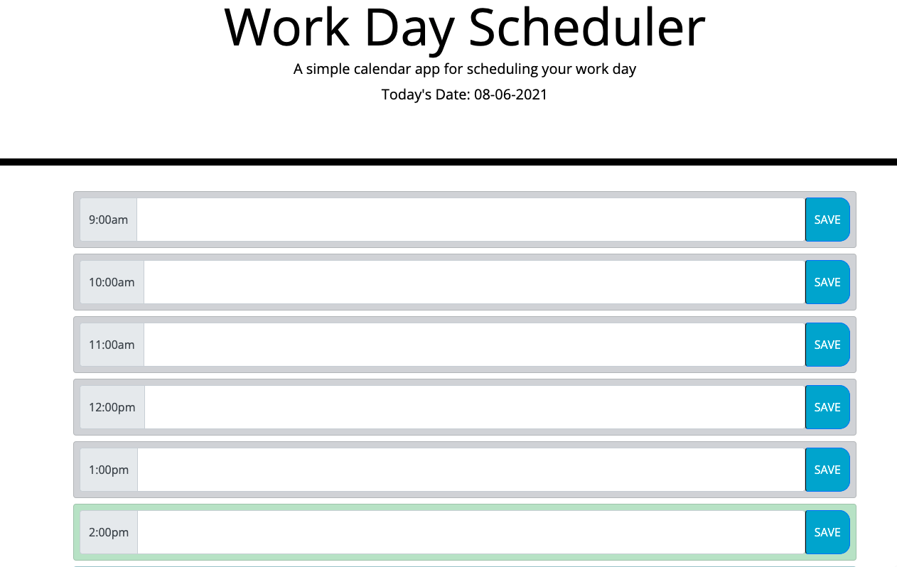

# DAYPLANNER-HAYDENHAUN-HW5

LIVE APP URL: https://hayden-haun.github.io/DAYPLANNER-HAYDENHAUN-HW5/

REPO URL: https://github.com/Hayden-Haun/DAYPLANNER-HAYDENHAUN-HW5

ABOUT: This application will allow a user to input activities into a planner for the work-hours of the current day. When the user clicks the save button, their responses will be saved in local storage to be accessible for later use. Additionally, each timeblock will be color coded depdending on whether the hour is past, present or future. Past blocks are grey, the current hour is green, and upcoming hours are blue.

TECHNOLOGIES USED: HTML, CSS, Javascript, jQuery, Moment.js

